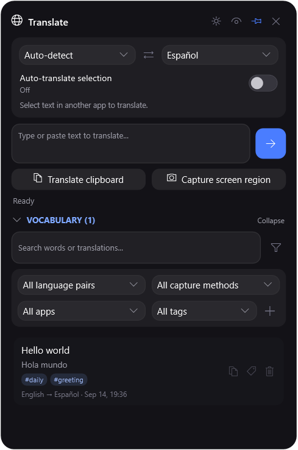
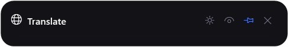
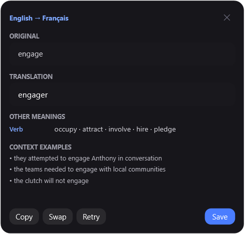
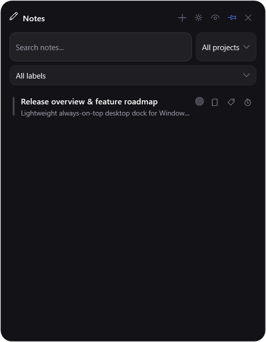

# Native Widget

[](https://github.com/Pelag-Michael/Native-Widget/releases/tag/v0.1.0-alpha)
[](https://github.com/Pelag-Michael/Native-Widget/releases/tag/v0.1.0-alpha)
[](https://dotnet.microsoft.com/download/dotnet/8.0)
[](https://github.com/Pelag-Michael/Native-Widget/actions/workflows/ci.yml)
[](LICENSE)

> A native, low-RAM Windows widget dock built with WPF and .NET 8 — no Electron,
> no bundled browser, no account required for local widgets.

Native Widget keeps Calendar, Tasks, Notes, Timers, Focus, OCR translation, and Projects
one hover away in small always-on-top windows. Google Calendar/Tasks sync is optional;
experimental Notion sync is available for Notes.

<p align="center">
  
</p>

## Download

**[Download Native Widget v0.1.0-alpha for Windows](https://github.com/Pelag-Michael/Native-Widget/releases/download/v0.1.0-alpha/Native-Widget-v0.1.0-alpha-win-x64.zip)**

1. Download `Native-Widget-v*-win-x64.zip` from Releases.
2. Extract the zip anywhere you own.
3. Run `NativeWidget.exe`.

The main package includes the .NET runtime and works on 64-bit Windows 10 (build 19041+) and
Windows 11. A smaller framework-dependent package is also available for machines that already
have the [.NET 8 Desktop Runtime](https://dotnet.microsoft.com/download/dotnet/8.0).

> This project is currently an alpha release. Windows SmartScreen may warn about an unsigned
> executable; review the source and release checksums before running it.

## Why this exists

The original prototype used Electron and measured roughly 300–400 MB of RAM for a handful of
small panels. Native Widget replaces the browser runtime with WPF and the Windows desktop stack.

| | Native Widget | Electron-style desktop wrapper |
|---|---|---|
| UI runtime | WPF / Windows desktop | Chromium + Node.js |
| Bundled browser engine | No | Usually yes |
| Platform focus | Windows 10/11 | Often cross-platform |
| Idle footprint on the development machine¹ | 96.2 MB working set / 44.8 MB private | Varies by app |
| Framework-dependent publish size¹ | 25.3 MB | Varies by app |

¹ Measured on 4 August 2026 with the launcher idle. Hardware, enabled integrations, and open
widgets affect memory. The numbers are a reproducible reference, not a universal benchmark.

## Widgets

| Widget | What it does |
|---|---|
| **Calendar** | 14-day Google Calendar agenda; create, repeat, inspect and delete events |
| **Tasks** | Google Tasks lists, subtasks, due dates, descriptions, colors and pop-out lists |
| **Notes** | Rich text, links, images, file attachments, labels, reminders and optional two-way Notion sync |
| **Timers** | Named duration or deadline timers that survive app and machine restarts |
| **Focus** | Minimal Pomodoro-style focus sessions |
| **Translate** | Hover panel, manual/selection translation, screen OCR, dictionary meanings, usage examples and a tagged vocabulary notebook |
| **Projects** | Current-focus tracker with optional Explorer folder links |

Tasks and Notes can be assigned to projects and filtered by them. A workspace search finds
matching notes, tasks, projects, labels, events and timers from one place.

Settings can optionally restore the previous desktop session: every widget that was still
open returns at its last position and size after Native Widget or Windows starts again.

## See it in action

| Idle hover rail | Dictionary meanings and real usage context |
|---|---|
|  |  |

| Notes | Expanded Translate workspace |
|---|---|
|  |  |

## Privacy and integrations

- Local notes, timers, projects, settings, window-session state and vocabulary live under `%AppData%\NativeWidget`.
- Credentials are entered in the Settings widget; they are never committed to this repository.
- Google and Notion integrations are optional. Local widgets work without an online account.
- The translation provider currently uses an undocumented Google endpoint; see the
  [architecture notes](NativeWidget/ARCHITECTURE.md#translate) before relying on it for sensitive text.

<details>
<summary><strong>Google Calendar and Tasks setup</strong></summary>

1. Open [Google Cloud Console](https://console.cloud.google.com), create a project, and enable
   the Google Calendar API and Google Tasks API.
2. Configure an External OAuth consent screen and add your email under **Test users**.
3. Create a **Web application** OAuth client.
4. Add `http://127.0.0.1:42813/callback` as an authorized redirect URI.
5. Paste the Client ID and Client secret into Native Widget Settings, then connect Calendar.

</details>

<details>
<summary><strong>Optional Notion Notes sync</strong></summary>

1. Create an integration at [notion.so/my-integrations](https://www.notion.so/my-integrations).
2. Connect that integration to the parent Notion page you want to use.
3. Paste the token and parent page ID into Settings, then enable Notion sync.

Native Widget creates a `NativeWidget Notes` database and syncs supported rich-text blocks,
images and attachments up to 20 MB. Unsupported blocks are left untouched. Deletion does not
currently propagate in either direction.

</details>

## Build from source

Requires the .NET 8 SDK.

```powershell
dotnet build NativeWidget/NativeWidget.csproj -c Release
dotnet run --project NativeWidget/NativeWidget.csproj
```

Create the same release archives used by GitHub Releases:

```powershell
./scripts/package-release.ps1 -Version 0.1.0
```

Architecture, storage formats and troubleshooting notes live in
[`NativeWidget/ARCHITECTURE.md`](NativeWidget/ARCHITECTURE.md).

## Keyboard shortcuts

| Shortcut | Action |
|---|---|
| `Ctrl+Alt+F` | Find the launcher and briefly expand it |
| `Ctrl+Alt+G` | Disable click-through mode on every widget |
| `Ctrl+S` | Save the current note and push it to Notion immediately |

## Contributing

Bug reports, small focused pull requests, screenshots and accessibility feedback are welcome.
Read [CONTRIBUTING.md](CONTRIBUTING.md) before opening a pull request. Security issues should be
reported through [SECURITY.md](SECURITY.md), not a public issue.

MIT licensed — see [LICENSE](LICENSE).
